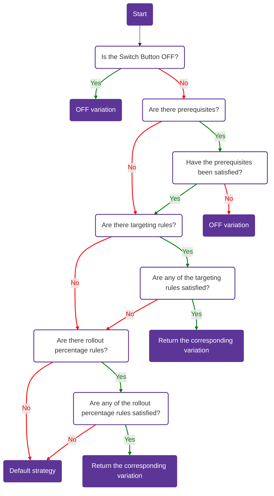

import CenteredImg from '@site/src/components/centered-img/CenteredImg';

The targeting tab in Bucketeer allows you to define which users or targets will see each variation of a flag. This powerful functionality enables you to roll out features for specific purposes like internal testing, private betas, or usability tests before conducting a broader release. Let's explore some examples.

:::info What targets are

While the Targeting tab refers to _users_, it's important to note that a user can represent any identifier that uniquely corresponds to a target. You can target users of your application, email addresses, systems, services, machines, resources, or any other entities that can be uniquely identified.

:::

To access the targeting page on the Bucketeer dashboard, access the **Feature Flags** tab, choose the desired flag, and click on is name. You will be redirected to the **Targeting** page for that flag.

## The targeting page

On the **Targeting** page, you will find a range of options to customize and control the behavior of your flags:

- **Switch Button**: Use the switch button to turn ON or OFF the targeting configuration for your feature flag. This allows you to activate or deactivate the targeting rules you have defined.
- [**Prerequisites**](/feature-flags/creating-feature-flags/targeting#prerequisites): Configure prerequisites to set up conditions for your flags. With prerequisites, you can establish dependencies between flags.
- [**Targeting**](/feature-flags/creating-feature-flags/targeting#targeting): Define targets for each variation of your flag. Examples of targets can be specific systems such as Android, iOS, and Web.
- [**Rule rollout percentage**](/feature-flags/creating-feature-flags/targeting#rollout-percentage): Manage the deployment risk by gradually rolling out your feature to a percentage of contexts. Start with a small portion and increase it as you gain confidence in the stability and effectiveness of your feature. This helps mitigate any potential issues that may arise during the rollout.
- **Default strategy**: Define the default variation for your flag. This variation is served when no specific targeting rule or prerequisite is met.
- **Off variation**: Specify the variation that is returned when the flag OFF.

:::info Restriction to change the default strategy 

If you have a [progressive rollout](/feature-flags/creating-feature-flags/auto-operation/progressive-rollout) running on the console, you will not be able to change the flag default strategy.

:::

The below image presents an example of the **Targeting** page.

<CenteredImg
  imgURL="img/feature-flags/targeting/targeting-page.png"
  alt="targeting page panel"
/>

## How targeting works

On the targeting page, you can define a series of conditions defining which flag variation the user will receive. Since several targeting options are provided, you need to understand the evaluation order. Otherwise, the targeting strategy may reflect something other than your objectives. To help you understand better, the list below shows the evaluation order with a description of the possible results.

1. **Switch Button**: If the switch is on the OFF position, users receive the OFF variation, and no further evaluation is required. Otherwise, the evaluation checks if prerequisites exist.
2. [**Prerequisites**](/feature-flags/creating-feature-flags/targeting#prerequisites): Evaluate all existing prerequisite flags, if they exist. If all flags return the selected variation, satisfying all conditions, the evaluation goes to the next stage, defined by targeting or rollout percentage. If one of the prerequisites fails, returning a different variation from the one specified, the user will receive the OFF variation, and no further evaluation is required.
3. [**Targeting**](/feature-flags/creating-feature-flags/targeting#targeting): After prerequisites are satisfied, the targets are evaluated. Each user or user group will receive the variation you defined. If the user/user group is not listed on any variation, rollout rules are evaluated if at least one exists. Otherwise, the user receives the default strategy variation.
4. [**Rule rollout percentage**](/feature-flags/creating-feature-flags/targeting#rollout-percentage): If no rule is satisfied, the user receives the default strategy variation.

The below flowchart summarizes how targeting on Bucketeer works.

<div style={{ textAlign: 'center' }}>

</div>

### Prerequisites

When a prerequisite flag is added to a targeting configuration, the target flag is only evaluated if the prerequisite flag's returned value matches the configured value. This means that the target flag is only evaluated if the prerequisite conditions are fully satisfied. 

If multiple flags are set as prerequisites, they are evaluated using the logical operator AND. This ensures that all prerequisite conditions are met before evaluating the target flag. In case the return value from one of the prerequisite flags is not as expected, the OFF variation in the target flag is returned. The OFF variation is used as a fallback option when the prerequisite conditions are not fulfilled.

The image below presents an example using two flags as prerequisites. Therefore, the targeting or rollout percentage evaluation will only happen if the first flag returns the **True** variation and the second returns the **Control** variation. Otherwise, the Bucketeer will provide the OFF variation.

<CenteredImg
  imgURL="img/feature-flags/targeting/prerequisites.png"
  alt="prerequisites example"
  wSize="500px"
/>

:::info Performance impact
When defining rollout rules based on other feature flags, consider the impact of performance on your system. If a flag to be evaluated has many dependencies, evaluating one flag may also evaluate many other flags, potentially affecting the performance of evaluation duration and the client's network load.
:::

### Individual Targeting

The Bucketeer individual targeting section allows you to define which specific users will receive each feature flag variation. You provide the **User IDs** for the users who will receive the selected variation, and these users will get the assigned variation regardless of any other rules or rollout conditions.

For a boolean flag example, you could provide a list of individual Android users to receive the `True` variation, and a separate list of iOS users for the `False` variation.

<CenteredImg
  imgURL="img/feature-flags/targeting/targeting-boolean-example.png"
  alt="targeting boolean example panel"
  wSize="500px"
/>


## Rollout percentage

The rollout percentage enables you to define rules to evaluate users. When the rule is satisfied, the user will receive the variation you have defined, or you can use a percentage distribution to determine which variation to return. The rules can be based on one or multiple conditions using:

- [User attributes](/feature-flags/creating-feature-flags/targeting#user-attributes)
- [User segments](/feature-flags/creating-feature-flags/targeting#user-segments)
- [Date](/feature-flags/creating-feature-flags/targeting#date)

:::info Combine the default strategy with the rollout percentage

In addition to selecting a specific variation as the default strategy, you can use the rollout percentage feature when defining the flag's default strategy.

<CenteredImg
  imgURL="img/feature-flags/targeting/rollout-combined-with-default-strategy.png"
  alt="Combine the default strategy with the rollout percentage"
  wSize="450px"
/>

:::

### User attributes

The user attributes used by rollout percentage rules refer to the end-user attributes. You can define these attributes when initializing the SDK on the client side. If you use dynamic attributes, use the `updateUserAttributes` function. For further details on how to set up attributes, check the [SDK](/sdk) content. The code block below presents an example of end-user attribute configuration when initializing the SDK using Javascript.

```js showLineNumbers
const attributes = {
  app_version: '1.0.0',
  os_version: '11.0.0',
  device_model: 'pixel-5',
  language: 'english',
  genre: 'female',
};

const user = defineBKTUser({
  id: 'USER_ID',
  attributes: attributes,
});

await initializeBKTClient(config, user);
```

When the SDK makes a request to the server, the Bucketeer system will have access to all attributes above to perform the targeting evaluation.

To use rollout rules based on end-user attributes, click **+ Add Rule** and select **Custom Rule**. To define the rules, select **Compare** for **Context kind**. Then, you can use any existing end-user attributes to compare and assign different variations.

:::info SemVer in Targeting Rules
Bucketeer supports semantic versioning (SemVer) for attributes like `app_version`. You can use SemVer in the targeting rules to control feature rollout based on application versions.
:::

:::caution SDK Version Format Differences
- **Node.js SDK**: Supports both formats (`1.2.3` and `v1.2.3`) and can compare between them.
- **Go SDK**: Requires consistent format - both values must use the same format (either both with `v` prefix or both without).

For reliable results, we recommend using the same version format consistently across your application.
:::

Suppose you created users using the attributes listed above the code block. For users with `app_version = 1.0.0` and `language = english`, you want to provide the **value-1** variation. On the other hand, for users with `app_version = 2.0.0`, you want to deliver all variations using a percentual distribution, where 10% will receive **value-1**, where 20% will receive **value-2**, where 30% will receive **value-3**, and where 40% will receive variation **value-4**. Such targeting rule could be defined on the Bucketeer dashboard as presented by the image below.

<CenteredImg
  imgURL="img/feature-flags/targeting/rollout-user-atributes.png"
  alt="rollout rule definition based on attributes"
/>

:::info Rollout percentage
When using rollout percentage based on percentual distribution, the sum should always be equal to 100%.
:::

If the user did not satisfy any of these rules, he would receive the default variation.

### User segments

A user segment enables you to create user groups based on the unique ID of end users defined when initializing the Bucketeer SDK.<br />
It allows you to create specific user targets to manage all users for a single feature flag variation or beta tests on a small number of users.

:::info Create segments
You can learn more about creating, managing, and using cases by accessing the [Segments](/feature-flags/segments) page.
:::

You can create segments based on various criteria, such as email type, gender, location, and more. This allows you to precisely target and group users for testing purposes.  The image below shows a rollout rule where the **value-1** variation is returned if the requesting user belongs to the **Testing Users** segment.

<CenteredImg
  imgURL="img/feature-flags/targeting/rollout-rule-segment.png"
  alt="rollout rule definition based on segment"
/>

### Date

You also can define rollout rules based on dates. The **Date** option is similar to the **Compare**, meaning it also is based on attributes configured on the SDK. However, the parameter must be in a timestamp format in this case. 

Therefore, to configure the **Date** option, you will need to provide:

- The attribute with the date information to be compared.
- The comparation option, **before** or **after**. 
- The comparison date.

When the SDK requests the server, the Bucketeer system will compare the date on the provided attribute with the selected date, considering the comparison option and delivering the variation you selected. 

For example, consider you created a rollout rule using the **Date** condition for the `creation_date` attribute. You want to deliver the `value-2` variation in case the creation date happened `before` **2025/08/19 18:00**. The image below presents the described configuration. In this scenario, if the `creation_date` value is older than **2025/08/19 18:00**, the user will receive the `value-2` variation. 


<CenteredImg
  imgURL="img/feature-flags/targeting/rollout-rule-date.png"
  alt="rollout rule definition based on date"
/>

### Feature flag

You can also define rollout rules based on other feature flags. The **Feature flag** option is similar to the [Prerequisites](/feature-flags/creating-feature-flags/targeting#prerequisites), meaning the condition is based on other feature flags' evaluations. The rule's condition is satisfied if the user is evaluated with the expected variation on the feature flag.

For example, consider you created a rollout rule within the **Feature flag** context. If the flag returns the `True` variation, the user will receive the `value-4` variation. The image below shows this configuration.

<CenteredImg
  imgURL="img/feature-flags/targeting/rollout-rule-feature-flag.png"
  alt="rollout rule definition based on feature flag"

/>

:::info Performance impact
When defining rollout rules based on other feature flags, consider the impact of performance on your system. If a flag to be evaluated has many dependencies, evaluating one flag may also evaluate many other flags, potentially affecting the performance of evaluation duration and the client's network load.
:::

:::info Combine conditions
Despite presenting examples using only one type of condition, you can combine user attributes, user segments, and date conditions on your system to improve the targeting of your rollout rules.
:::