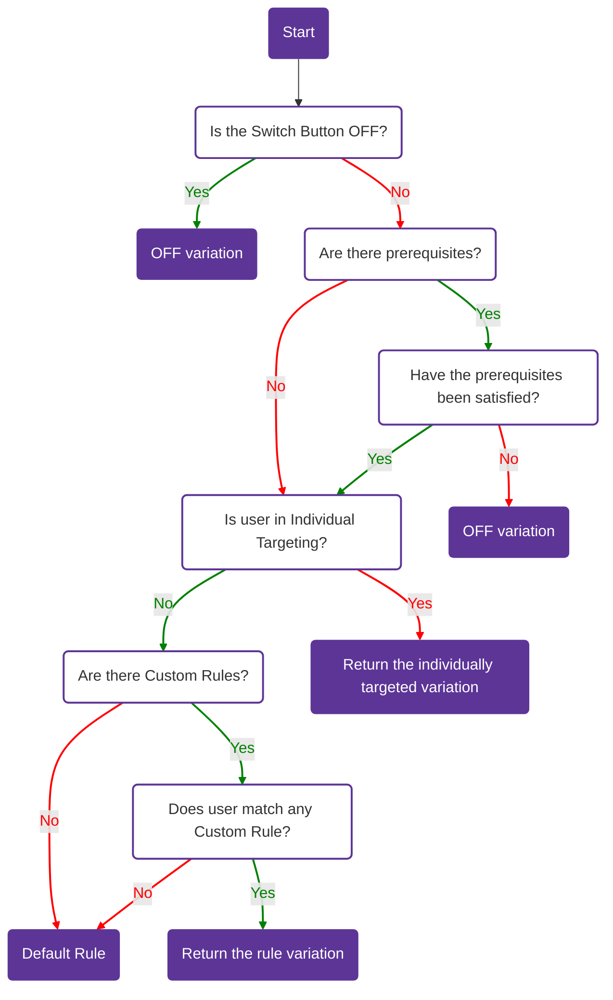

import CenteredImg from '@site/src/components/centered-img/CenteredImg';

The targeting tab in Bucketeer allows you to define which users or targets will see each variation of a flag. This powerful functionality enables you to roll out features for specific purposes like internal testing, private betas, or usability tests before conducting a broader release.

:::info What targets are

While the Targeting tab refers to _users_, it's important to note that a user can represent any identifier that uniquely corresponds to a target. You can target users of your application, email addresses, systems, services, machines, resources, or any other entities that can be uniquely identified.

:::

To access the targeting page on the Bucketeer dashboard, access the **Feature Flags** tab, choose the desired flag, and click on its name. You will be redirected to the **Targeting** page for that flag.

## The targeting page

The **Targeting** page provides several options to control which users see each flag variation. The image below shows the targeting configuration interface:

<CenteredImg
  imgURL="img/feature-flags/targeting/targeting-page.png"
  alt="targeting page panel"
/>

The targeting system evaluates users in a specific order. Understanding this order is crucial for configuring your flags correctly. See [How targeting works](/feature-flags/creating-feature-flags/targeting#how-targeting-works) below for details.

## How targeting works

The targeting system evaluates users through a specific order of rules. Each step determines whether to continue evaluation or return a variation immediately. Understanding this flow is essential for creating effective targeting strategies.

### Evaluation Order

1. **Switch Button** - If the flag is OFF, users immediately receive the OFF variation. No further evaluation occurs.

2. **[Prerequisites](/feature-flags/creating-feature-flags/targeting#prerequisites)** - If the flag is ON, Bucketeer checks if any prerequisite flags exist. Prerequisites create dependencies between flags. All prerequisite flags must return their specified variations for evaluation to continue. If any prerequisite fails, the user receives the OFF variation.

3. **[Individual Targeting](/feature-flags/creating-feature-flags/targeting#individual-targeting)** - Next, the system checks if the user's ID matches any individually targeted users. Individual targeting assigns specific variations to specific user IDs. Matches here return immediately with the assigned variation.

4. **[Custom Rules](/feature-flags/creating-feature-flags/targeting#custom-rules)** - If the user isn't individually targeted, custom rules are evaluated in order. Each rule defines conditions (user attributes, segments, dates, or feature flags) and an assigned variation. The first matching rule returns its variation. Rules can also use rollout percentage to distribute users across multiple variations.

5. **[Default Rule](/feature-flags/creating-feature-flags/targeting#default-rule)** - If no rules match, the user receives the default rule variation. The default rule can return a specific variation or use rollout percentage distribution. You can also control what percentage of your audience receives the flag evaluation using Audience Traffic Allocation.

:::info Progressive Rollout Restriction

If you have a [progressive rollout](/feature-flags/creating-feature-flags/auto-operation/progressive-rollout) running, you cannot modify the default rule until the rollout completes.

:::

The below flowchart summarizes how targeting on Bucketeer works.

### Prerequisites

When a prerequisite flag is added to a targeting configuration, the target flag is only evaluated if the prerequisite flag's returned value matches the configured value. This means that the target flag is only evaluated if the prerequisite conditions are fully satisfied. 

If multiple flags are set as prerequisites, they are evaluated using the logical operator AND. This ensures that all prerequisite conditions are met before evaluating the target flag. In case the return value from one of the prerequisite flags is not as expected, the OFF variation in the target flag is returned. The OFF variation is used as a fallback option when the prerequisite conditions are not fulfilled.

The image below presents an example using two flags as prerequisites. Therefore, the targeting or rollout percentage evaluation will only happen if the first flag returns the **True** variation and the second returns the **Control** variation. Otherwise, Bucketeer will provide the OFF variation.

<CenteredImg
  imgURL="img/feature-flags/targeting/prerequisites.png"
  alt="prerequisites example"
  wSize="500px"
/>

:::info Performance impact
When defining targeting rules based on other feature flags, consider the impact on performance. If a flag has many dependencies, evaluating one flag may also evaluate many other flags, potentially affecting the evaluation duration and the client's network load.
:::

### Individual Targeting

The Bucketeer individual targeting section allows you to define which specific users will receive each feature flag variation. You provide the **User IDs** for the users who will receive the selected variation, and these users will get the assigned variation regardless of any other rules or rollout conditions.

For a boolean flag example, you could provide specific user IDs (e.g., `user-123`, `user-456`, `qa-tester-1`) to receive the `True` variation, and a different set of user IDs to receive the `False` variation. These individually targeted users will receive their assigned variation regardless of any other rules or rollout conditions.

<CenteredImg
  imgURL="img/feature-flags/targeting/individual-targeting.png"
  alt="individual targeting"
  wSize="500px"
/>

:::info Platform-based Targeting
For platform-based targeting (e.g., targeting all Android vs iOS users), use **Custom Rules** with user attributes instead of Individual Targeting. Individual Targeting is specifically designed for targeting by unique user IDs.
:::

## Custom Rules

Custom rules allow you to define conditions to evaluate users and assign them to specific variations. When the rule conditions are satisfied, the user will receive the variation you defined. You can also use rollout percentage distribution within a rule to split users between multiple variations.

### Rule Types

Bucketeer supports four types of custom rule conditions, all unified under [Custom Rules](/feature-flags/creating-feature-flags/targeting/custom-rules):

#### User Attributes
Target users based on their attributes like `app_version`, `language`, `device_model`, or any custom attributes you define. This is the most flexible targeting option.

**Example use cases**: Progressive rollout by app version, platform-specific features, localization testing

#### User Segments
Target predefined groups of users by their IDs. Create reusable segments like "Beta Testers", "VIP Users", or "Internal Team" and apply them across multiple flags.

**Example use cases**: Beta testing, VIP features, internal testing, regional rollouts

#### Date-Based Conditions
Target users based on time-related conditions using timestamp attributes. Compare dates with "before" or "after" operators.

**Example use cases**: Grandfathering users, time-limited access, anniversary promotions

#### Feature Flag Dependencies
Create dependencies between flags by using other flags as conditions. Different from prerequisites, these are evaluated within custom rules.

**Example use cases**: Progressive feature rollout, feature bundling, gradual migration

:::info Combine conditions
You can combine multiple condition types in your custom rules to create sophisticated targeting strategies. For example, target users who are in a specific segment AND have a certain app version AND registered before a certain date.
:::

## Default Rule

The default rule defines the fallback behavior when no other rules match. This is the last step in the evaluation order, making it crucial for your flag's behavior.

### Audience Traffic Allocation

The **Audience Traffic Allocation** feature allows you to control what percentage of your total traffic receives the flag evaluation, with the remainder excluded entirely. This is particularly useful for:

- **Controlled experiments** - Test on 10% of traffic while excluding 90%
- **Beta launches** - Gradually expose features to increasing audience percentages
- **Risk mitigation** - Limit exposure during initial rollouts

For example, you can set the audience allocation to 10%, then apply a 50/50 rollout split within that 10% audience. This means only 5% of your total users receive each variation, while 90% are excluded from the experiment entirely.

<CenteredImg
  imgURL="img/feature-flags/targeting/rollout-combined-with-default-strategy.png"
  alt="Default rule with audience traffic allocation and variation percentage split"
  wSize="450px"
/>

### Variation Allocation

Within the audience that receives the flag (determined by Audience Traffic Allocation), you can distribute users across variations using either:

- **Split equally** - Automatically divides traffic evenly across all variations
- **Split by custom percentage** - Manually define the percentage for each variation

The audience split happens first, then the variation allocation applies to the included audience.

