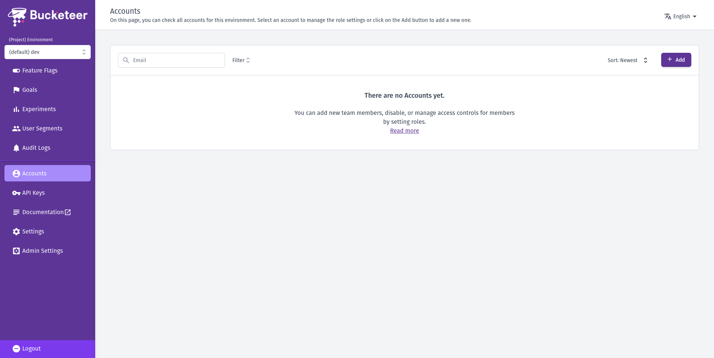
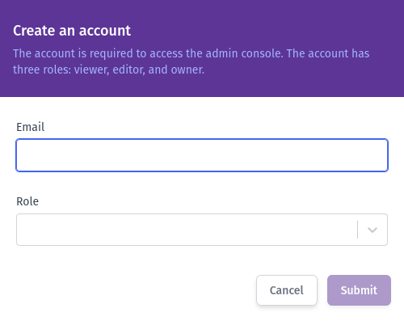

Buckteers is an open-source project that allows you to manage and track data related to different environments. To begin using Buckteers, you need to create an account. This guide assumes that the Buckteers system is already up and running and that you have access to an Admin account.

## Account types

There are two types of accounts available in Buckteers, each with different access levels:

- **Admin account**: it provides full access and control over all existing projects. Users with admin accounts can access all existing environments and manage other users accounts.

- **Enviroment account**: it is associated with a specific environment on the platform. Users with Enviroment accounts can only access tags, reports, and data related to that particular environment.

### Enviroment account roles

In addition to being limited to a specific environment, Environment accounts also have predefined roles assigned during the account creation process. The defined role will change the account access level. The available roles for Environment accounts are described below:

- **Viewer**: viewers have read-only access to their assigned environments. They can view all data but cannot make any modifications. This role is suitable for individuals in your organization who need visibility into feature flags without the ability to modify rollout rules or administer the system.
- **Editor**: editors can modify feature flags, goals, experiments, and more within their assigned environments. However, they do not have the authority to add new team members to the account.
- **Owner**: owners possess complete control over their assigned environments. They can perform various actions and make changes across the environment, including adding and removing team members.

:::note

If you are using the Bucketeer system, to create an Admin account you need to get in touch with the Bucketeer team.

As a open-souce project, you also can host your own Buckteers version and create an Admin account for your.

:::

## Creating a normal account

To add a new member to a Buckteer organization, an Admin needs to create a normal account. 

:::note

Only Admins are capable of creating normal accounts.

:::

As an Admin, you can follow the steps below to crate a normal account for a new user:

1. Access the [Bucketeer Dashboard](https://dev.bucketeer.jp/) using your Admin account credentials.
2. Select the desired project environment from the available options.
3. Navigate to the Accounts page within the Dashboard.
4. Click on the **+ Add** button to add a new account.

5. On the left panel, enter the new user's email and define their role.
6. Click **Submit** to create the account.

The newly added member will receive an email invitation to join the project. If the new user does not receive the invitation email, the Admin can resend it by going to the Accounts page, locating the user's name in the Accounts list, and clicking on it.

