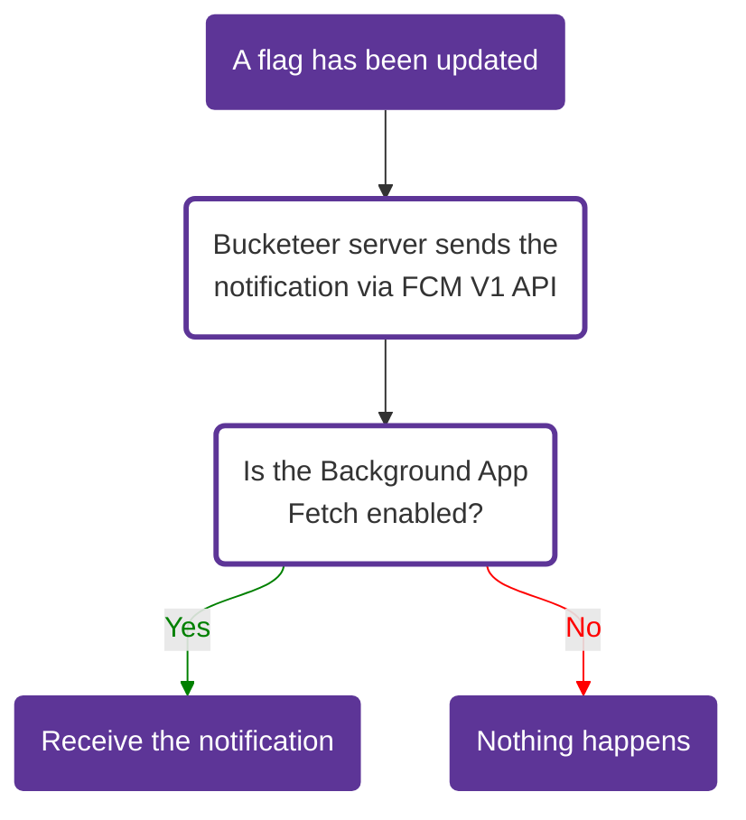

import Tabs from '@theme/Tabs';
import TabItem from '@theme/TabItem';
import CenteredImg from '@site/src/components/centered-img/CenteredImg';

The FCM (Firebase Cloud Messaging) feature is designed to send silent notifications with normal priority to your applications through **Google Firebase Cloud Messaging (FCM)**.

These silent notifications let your applications know when a flag changes in real time, so you can fetch the client cache and keep it always updated.

## Accessing FCM Pushes

1. Click the gear icon at the bottom of the left sidebar
2. Select **FCM** from the Integrations section

<CenteredImg
  imgURL="img/organization-settings/fcm-pushes-list.png"
  alt="FCM pushes list"
  wSize="100%"
/>

## Creating an FCM Push

To create a push notification, click the **+ Add** button on the FCM page.

<CenteredImg
  imgURL="img/organization-settings/create-fcm-push-modal.png"
  alt="Create FCM push modal"
  wSize="400px"
  borderWidth="1px"
/>

- **Name** - This identifies the push. Use descriptive names.
- **Firebase Cloud Messaging Service Account** - Upload the JSON file containing your FCM service account credentials. This allows Bucketeer to request the OAuth Access Token needed to send notifications.
- **Environment** - Select the environment that will receive push notifications.
- **Feature Flag Tags** (Optional) - Add tags related to the flags you wish to monitor. Upon updating or modifying a flag with the provided tag, the push notification will be triggered. You can select one or multiple tags.

:::info Tag selection
You can include multiple tags while creating a push. However, for larger user groups requiring numerous notifications, there might be a time delay or potential server overload on FCM.

Bucketeer's team suggests using distinct FCM service accounts for each user group and associating specific tags with each group. This strategy minimizes the number of notifications to be sent when a flag changes.
:::

:::info FCM Service Account
Please be aware that you can only create one Push using the same FCM service account.
:::

After defining the Name, FCM Service Account, Environment, and optionally the Feature Flag Tags, click on **Submit** to create the push.

## Push notifications restrictions

To Bucketeer send silent notifications, it depends on whether users have granted permission and how the platform manages background tasks. Here's a breakdown for both Android and iOS:

### Android

Silent notifications can be sent without explicit user permission, but background task limitations and restrictions may apply.

### iOS

Users must grant the **Background App Refresh** permission to receive silent notifications. Refer to the flowchart below for an overview of the push notification process.

<div style={{ textAlign: 'center' }}>

</div>

:::info Auto cache updates
Even if the user doesn't receive notifications, the client SDK will continue polling the latest cache from the server in the background.
:::

## Update user evaluation in real time

When using the FCM integration, your applications must subscribe to Bucketeer's topic, so they can receive notifications.

The topic varies depending on the feature flag **tag**.<br />
E.g: **bucketeer-\<YOUR_FEATURE_FLAG_TAG\>**

Bucketeer will send the notification including the data **\{"bucketeer_feature_flag_updated":"true"\}**, so you can check if you need to fetch the client cache.

:::info Subscription Topic
The tag in the topic is the same tag used when initializing the client SDK.<br />
If you have a flag using the `android` tag, the topic will be **bucketeer-android**.

If you're not using tags (both the feature flag and push have no tags), you should subscribe to the default topic: **bucketeer-default**
:::

<Tabs groupId="integrate-buckteer-platform">
<TabItem value="kt" label="Kotlin">

```kotlin showLineNumbers
// In order to receive notifications you must subscribe to the topic
private fun subscribeToTopic() {
  val tag = "android" // The same tag used when initializing the client SDK
  Firebase.messaging
    .subscribeToTopic("bucketeer-$tag")
    .addOnCompleteListener { task ->
      var msg = "Subscribed successfully"
      if (!task.isSuccessful) {
        msg = "Failed to subscribe"
      }
      Log.d(TAG, msg)
    }
}

// For no-tags scenario, subscribe to the default topic
private fun subscribeToDefaultTopic() {
  val topic = "bucketeer-default"
  Firebase.messaging
    .subscribeToTopic(topic)
    .addOnCompleteListener { task ->
      var msg = "Subscribed successfully to $topic"
      if (!task.isSuccessful) {
        msg = "Failed to subscribe to $topic"
      }
      Log.d(TAG, msg)
    }
}

override fun onMessageReceived(remoteMessage: RemoteMessage?) {
  remoteMessage?.data?.also { data ->
    val isFeatureFlagUpdated = data["bucketeer_feature_flag_updated"]
    if (isFeatureFlagUpdated == "true") {
      // The callback will return without waiting until the fetching variation process finishes
      val timeout = 1000 // Default is 5 seconds

      val future = client.fetchEvaluations(timeout)
      val error = future.get()
      if (error == null) {
        val showNewFeature = client.booleanVariation("YOUR_FEATURE_FLAG_ID", false)
        if (showNewFeature) {
            // The Application code to show the new feature
        } else {
            // The code to run when the feature is off
        }
      } else {
        // Handle the error
      }
    }
  }
}
```

</TabItem>

<TabItem value="swift" label="Swift">

```swift showLineNumbers
// In order to receive notifications you must subscribe to the topic
func subscribeToTopic() {
    let tag = "ios"  // The same tag used when initializing the client SDK
    let topic = "bucketeer-\(tag)"
    Messaging.messaging().subscribe(toTopic: topic) { error in
        if let error = error {
            print("Failed to subscribed to \(topic) topic. Error: \(error)")
        } else {
            print("Subscribed successfully to \(topic) topic")
        }
    }
}

// For no-tags scenario, subscribe to the default topic
func subscribeToDefaultTopic() {
    let topic = "bucketeer-default"
    Messaging.messaging().subscribe(toTopic: topic) { error in
        if let error = error {
            print("Failed to subscribed to \(topic) topic. Error: \(error)")
        } else {
            print("Subscribed successfully to \(topic) topic")
        }
    }
}

// Receiving notification in background
func application(
  _ application: UIApplication,
  didReceiveRemoteNotification userInfo: [AnyHashable: Any]
) async -> UIBackgroundFetchResult {
  let flag = userInfo["bucketeer_feature_flag_updated"] as? String
  if flag == "true" {
    let client = BKTClient.shared
    let showNewFeature = client.boolVariation(featureId: "YOUR_FEATURE_FLAG_ID", defaultValue: false)
    if (showNewFeature) {
        // The Application code to show the new feature
    } else {
        // The code to run when the feature is off
    }
  }
  return UIBackgroundFetchResult.newData
}
```

</TabItem>

<TabItem value="dart" label="Dart">

```dart showLineNumbers
/// In order to receive notifications you must subscribe to the topic
void subscribeToTopic() {
  String tag = "flutter";
  String topic = "bucketeer-$tag";

  FirebaseMessaging.instance.subscribeToTopic(topic).then((_) {
    debugPrint("Subscribed successfully to $topic topic");
  }).catchError((error) {
    debugPrint("Failed to subscribed to $topic topic. Error: $error");
  });
}

/// For no-tags scenario, subscribe to the default topic
void subscribeToDefaultTopic() {
  String topic = "bucketeer-default";

  FirebaseMessaging.instance.subscribeToTopic(topic).then((_) {
    debugPrint("Subscribed successfully to $topic topic");
  }).catchError((error) {
    debugPrint("Failed to subscribed to $topic topic. Error: $error");
  });
}

FirebaseMessaging.onMessage.listen((RemoteMessage message) async {
  final isFeatureFlagUpdated = message.data["bucketeer_feature_flag_updated"]
    if (isFeatureFlagUpdated "true") {
      int timeout = 1000;
      const client = BKTClient.instance;
      final result = await client.fetchEvaluations(timeoutMillis: timeout);
      if (result.isSuccess) {
        final showNewFeature = await client
            .boolVariation("YOUR_FEATURE_FLAG_ID", defaultValue: false);
        if (showNewFeature) {
          /// The Application code to show the new feature
        } else {
          /// The code to run if the feature is off
        }
      } else {
        /// Handle the error when the cache is not updated
        if (result.asFailure.exception is BKTTimeoutException) {
          /// Handle timeout error
        } else {
          /// Anything else
        }
      }
    }
});
```

</TabItem>

</Tabs>

